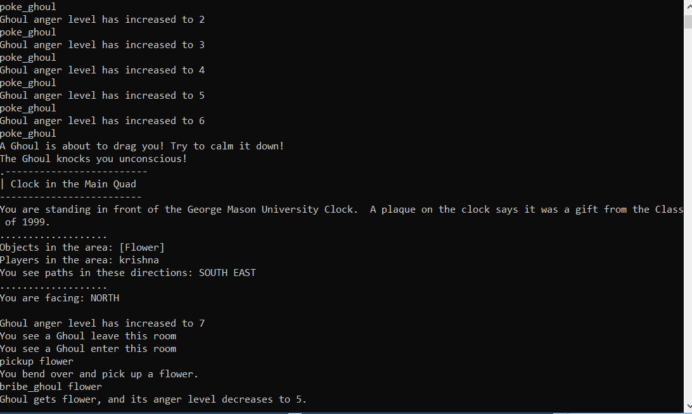

# Ghoul's anger level:
The Ghoul has an anger level (starting at 0, the lowest), 
which is altered through the user's interactions with the ghoul.
The inclusion of the anger level enriches gameplay due to adding
interactions with NPCs.
#### Poking the Ghoul:
An action a player can do by calling the 'poke_ghoul' input. 
When called, if the ghoul is in the room, its anger level goes up by one, 
and it will say a statement giving the user an idea of how angry it is.
#### Giving an item to the Ghoul:
A player can give an item to the ghoul, using the 'bribe_ghoul (item name)' input. 
If the item you are planning to give is in your inventory, 
then the ghoul's anger level will go down and you get a message saying so.
If the ghoul's anger level is at 
#### Ghoul's Dragging Ability:
When the ghoul's anger level is poked to above 7, 
the ghoul will knock the player who poked it unconscious, 
then drag them to the clock tower. 
Then, it will proceed to take a random item
from the player's inventory, and lowers its anger by 1.

Example from in game: 
      
